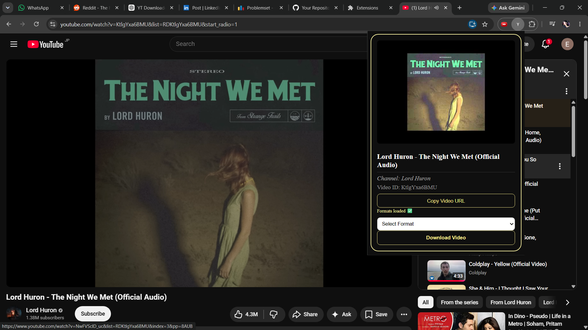
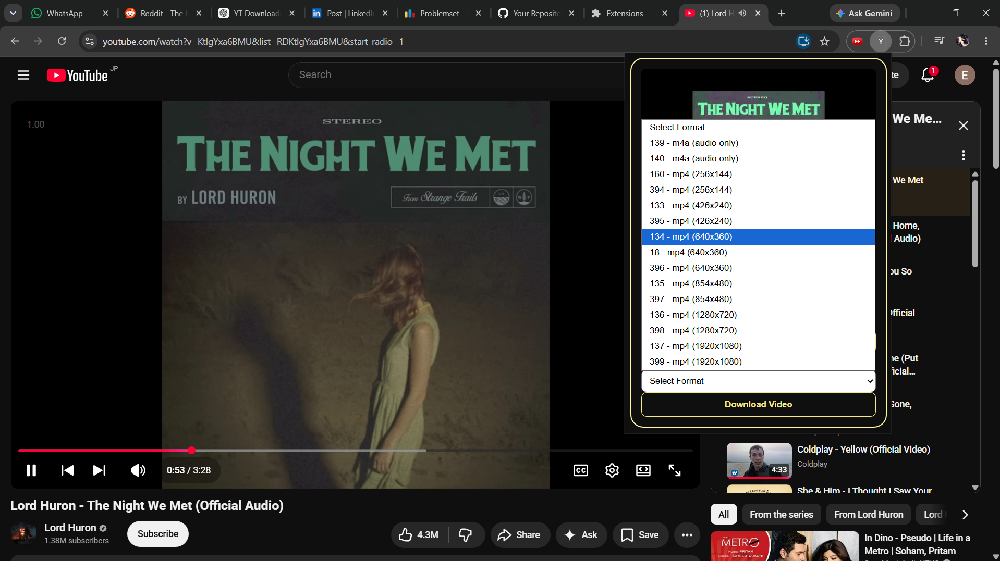

# YT Downloader Extension

A Chrome Extension that extracts YouTube video metadata and downloads videos using a Node.js backend powered by yt-dlp.

## Features

* Extract YouTube video metadata

  * Video Title
  * Channel Name
  * Thumbnail
  * Video ID
* Display available download formats
* Download videos directly from the extension
* Uses yt-dlp for reliable downloads
* Shows Downloading percentage
* Built using Chrome Extension Manifest V3
* Node.js + Express backend

## Tech Stack

* JavaScript
* Chrome Extensions API
* Node.js
* Express.js
* yt-dlp
* HTML
* CSS

## Project Structure

```text
yt-downloader-extension/
│
├── backend/
│   ├── app.js
│   ├── package.json
│   ├── package-lock.json
│   └── downloads/
│
├── extension/
│   ├── manifest.json
│   ├── popup.html
│   ├── popup.js
│   └── style.css
│
├── screenshots/
│
├── README.md
└── .gitignore
```

## Prerequisites

Before running the project, make sure you have:

* Node.js installed
* Python installed
* yt-dlp installed

Install yt-dlp:

```bash
pip install yt-dlp
```

Verify installation:

```bash
python -m yt_dlp --version
```

## Installation

### 1. Clone the repository

```bash
git clone https://github.com/pratapaditya059-cell/yt-downloader-extension
```

### 2. Open the project

```bash
cd yt-downloader-extension
```

### 3. Install backend dependencies

```bash
cd backend
npm install
```

### 4. Start the backend server

```bash
node app.js
```

You should see:

```text
Server running on port 3000
```

## Loading the Chrome Extension

1. Open Chrome
2. Go to:

```text
chrome://extensions
```

3. Enable Developer Mode
4. Click "Load unpacked"
5. Select the `extension` folder

```text
yt-downloader-extension/
└── extension
```

6. The extension should now appear in Chrome.

## Usage

1. Start the backend server

```bash
cd backend
node app.js
```

2. Open any YouTube video
3. Click the extension icon
4. Wait for formats to load
5. Select a format
6. Click "Download Video"

Downloaded files will be saved inside:

```text
backend/downloads/
```

## Screenshots


### Extension UI



### Download Formats



## Future Improvements

* Better UI/UX
* Download history
* Automatic filename customization